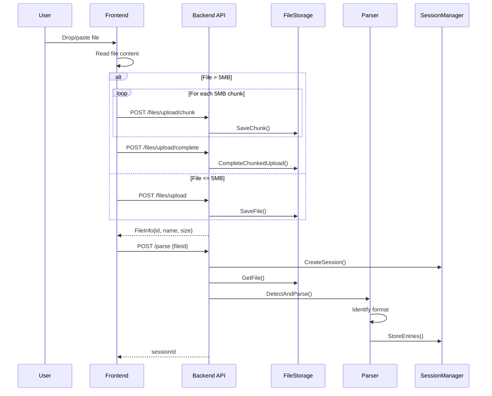
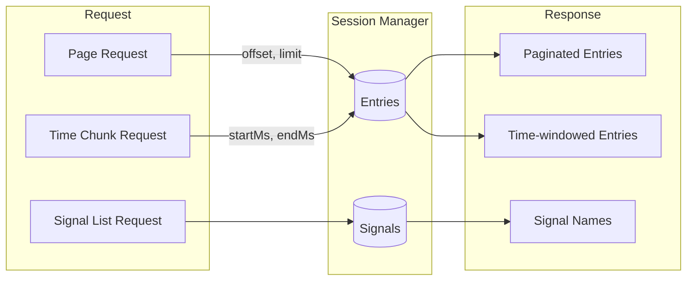
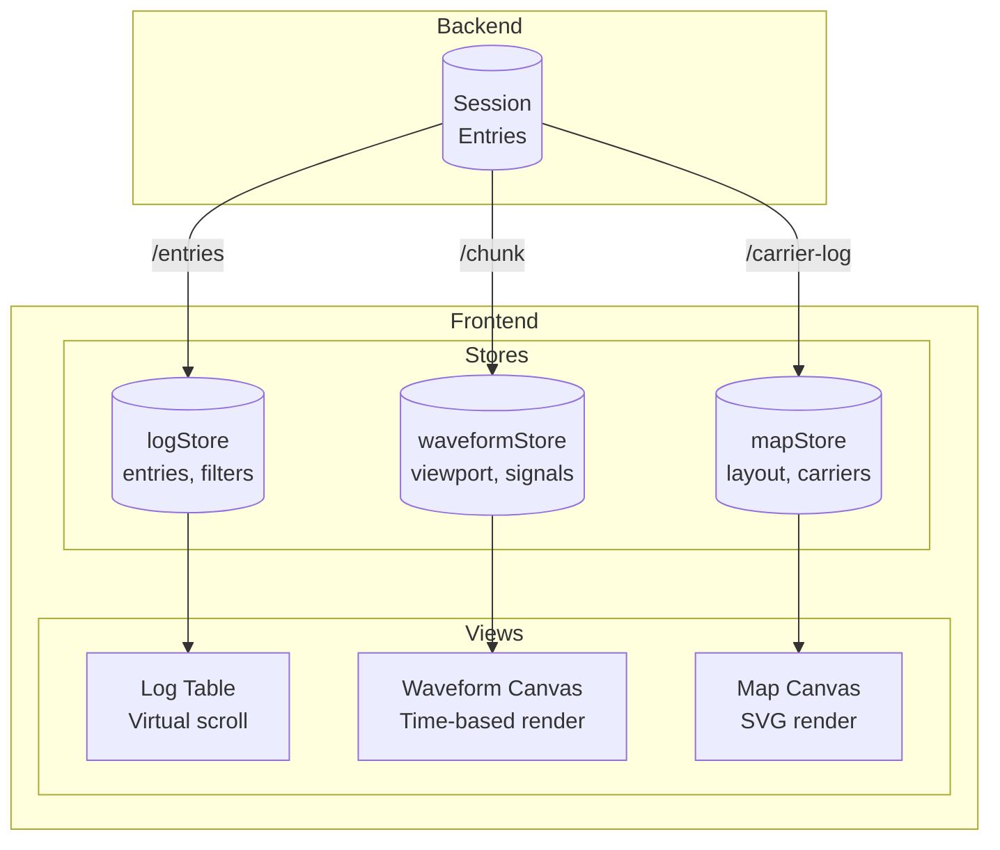
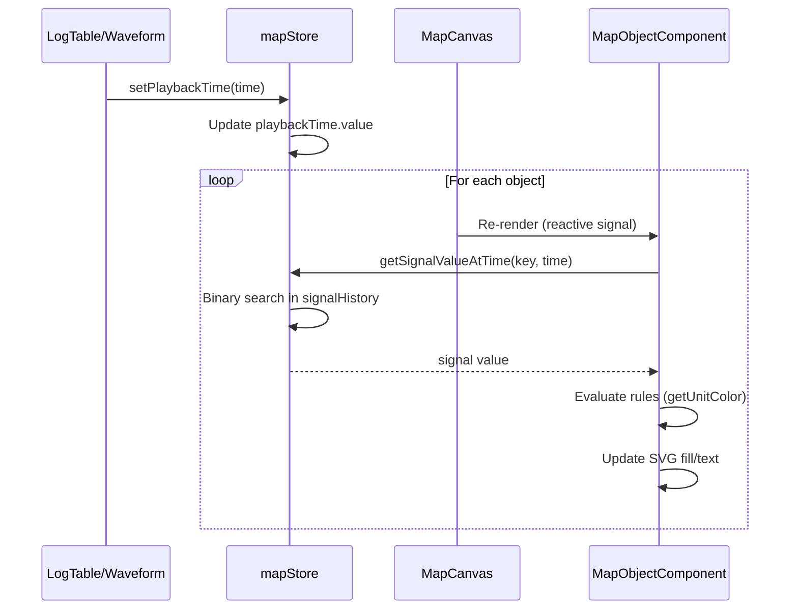
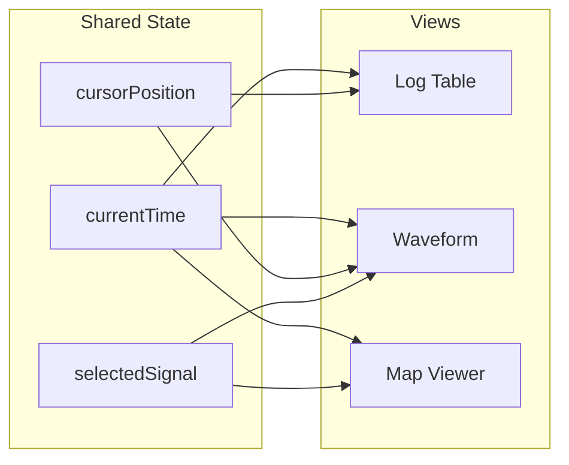

# Data Flow Architecture

How data flows through the application from file upload to visualization.

## File Upload & Parsing Flow

## Log Entry Retrieval

## Visualization Data Flow

## Map Playback Flow

## State Synchronization

