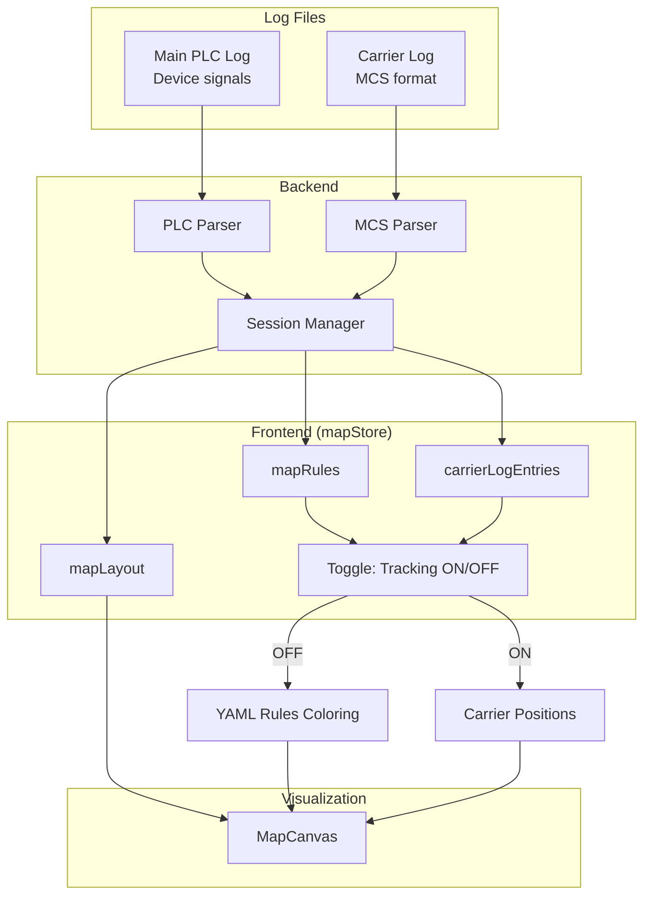
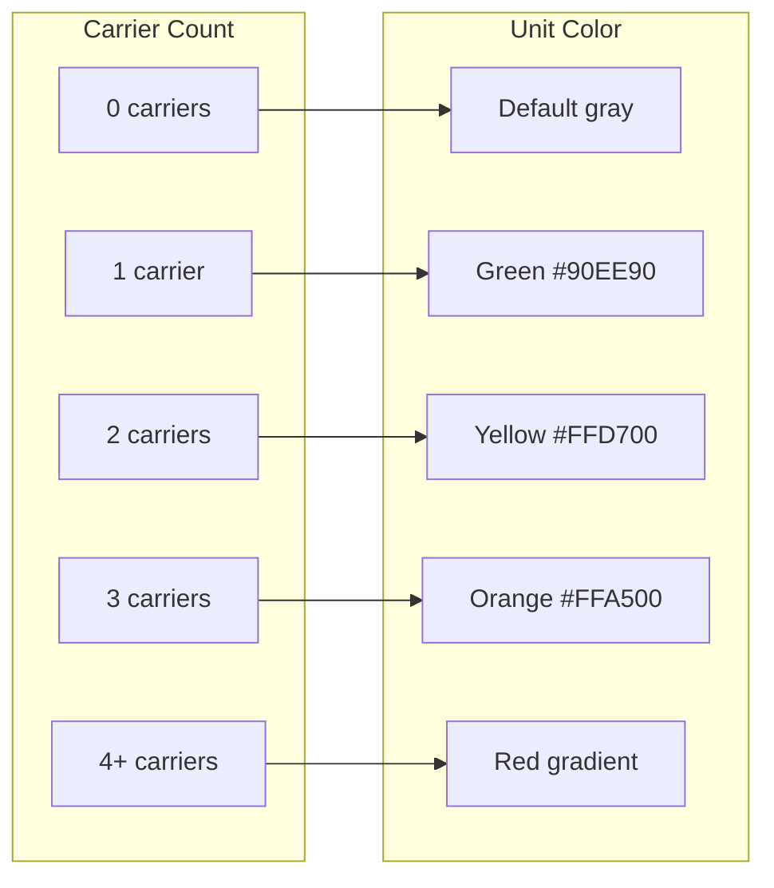
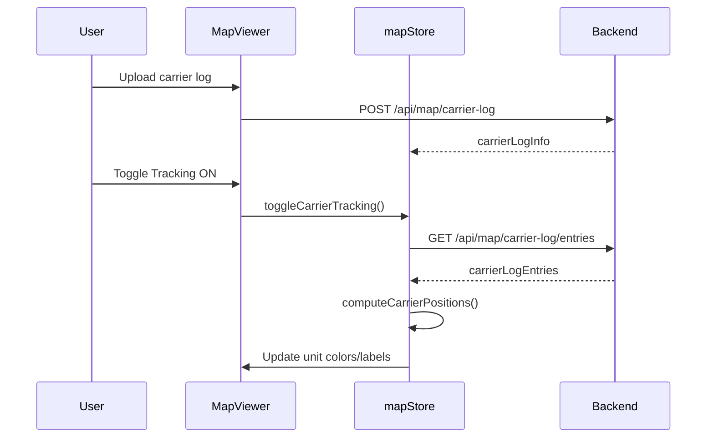

# Map Viewer: Dual Log System

The Map Viewer supports two separate log files for different visualization modes.

## Overview



## Configuration Files

| File Type | Format | Purpose | API Endpoint |
|-----------|--------|---------|--------------|
| Layout | XML | Unit positions, sizes, types | `POST /api/map/upload` |
| Rules | YAML | Device-to-unit mappings, color rules | `POST /api/map/rules` |
| Carrier Log | MCS Log | `CurrentLocation` signals | `POST /api/map/carrier-log` |

## Toggle Behavior

| Tracking State | Data Source | Visualization | Unit Colors |
|----------------|-------------|---------------|-------------|
| **OFF** | Main log + YAML rules | Signal-based coloring | From YAML rules |
| **ON** | Carrier log (MCS) | Carrier positions | By carrier count |

## Carrier Count Color Coding



## Data Flow for Carrier Tracking



## MapStore State

```typescript
// Key signals in mapStore.ts
mapLayout: Signal<MapLayout | null>          // XML layout data
mapRules: Signal<MapRules | null>            // YAML rules data  
carrierLogInfo: Signal<CarrierLogInfo | null>  // Carrier log file info
carrierLogEntries: Signal<CarrierEntry[]>    // Parsed carrier entries
carrierTrackingEnabled: Signal<boolean>      // Toggle state
carrierLocations: Signal<Map<string, string>> // carrierId → unitId

// Computed
unitCarrierCounts: Computed<Map<string, number>>  // unitId → count
mapObjectsArray: Computed<MapObject[]>            // Array of map objects
```
