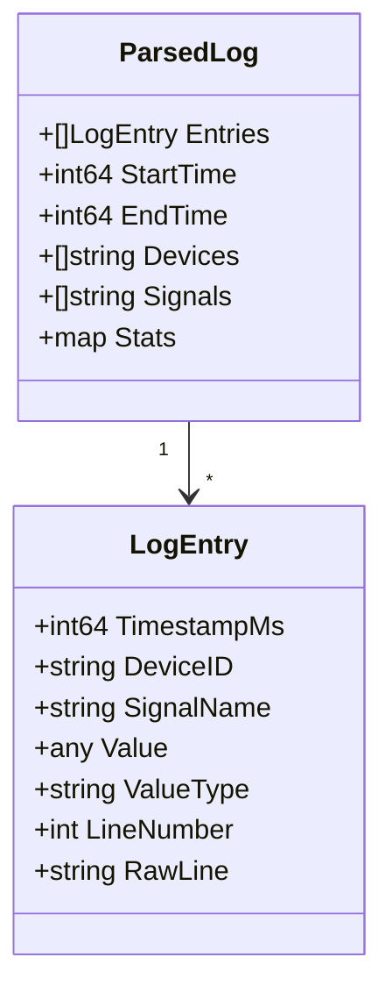
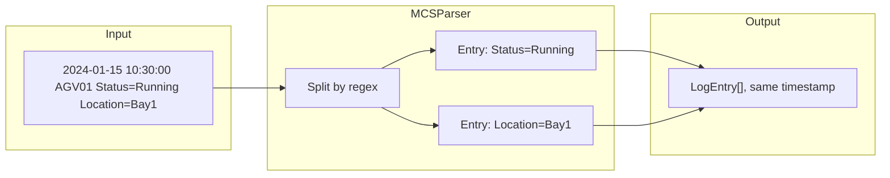

# Log Parser Architecture

How log files are parsed and processed in the backend.

## Parser Registry

```mermaid
flowchart TB
    subgraph Input
        File[Log File]
    end
    
    subgraph Registry["Parser Registry"]
        Detect{Detect Format}
        PLC[PLCDebugParser]
        TAB[PLCTabParser]
        MCS[MCSLogParser]
        CSV[CSVSignalParser]
    end
    
    subgraph Output
        Entries[LogEntry[]]
    end
    
    File --> Detect
    Detect -->|Bracket format| PLC
    Detect -->|Tab-delimited| TAB
    Detect -->|AMHS/MCS format| MCS
    Detect -->|CSV format| CSV
    
    PLC --> Entries
    TAB --> Entries
    MCS --> Entries
    CSV --> Entries
```

## Format Detection

The registry reads the first few lines and matches patterns:

| Format | Detection Pattern | Example |
|--------|-------------------|---------|
| PLC Debug | `[timestamp] [device] [signal] [value]` | `[2024-01-15 10:30:00.123] [AGV01] [Status] [Running]` |
| PLC Tab | Tab-separated with header | `Timestamp\tDevice\tSignal\tValue` |
| MCS/AMHS | Contains `CarrierID` or `CurrentLocation` | MCS-specific headers |
| CSV | Comma-separated with header | `timestamp,device,signal,value` |

## Parser Interface

```go
type Parser interface {
    // Name returns the unique name of the parser
    Name() string
    
    // CanParse returns true if this parser can handle the given file
    CanParse(filePath string) (bool, error)
    
    // Parse parses the entire file and returns the result
    Parse(filePath string) (*models.ParsedLog, []*models.ParseError, error)
}
```

## LogEntry Model



## MCS Parser: Multi-Entry Lines

MCS logs can have multiple signals per line:



## Backend File Structure

```
backend/internal/parser/
├── parser.go          # Parser interface, utilities
├── registry.go        # Format detection, parser selection
├── plc_debug.go       # PLCDebugParser
├── plc_tab.go         # PLCTabParser
├── mcs.go             # MCSLogParser
├── csv.go             # CSVSignalParser
└── *_test.go          # Unit tests for each
```
