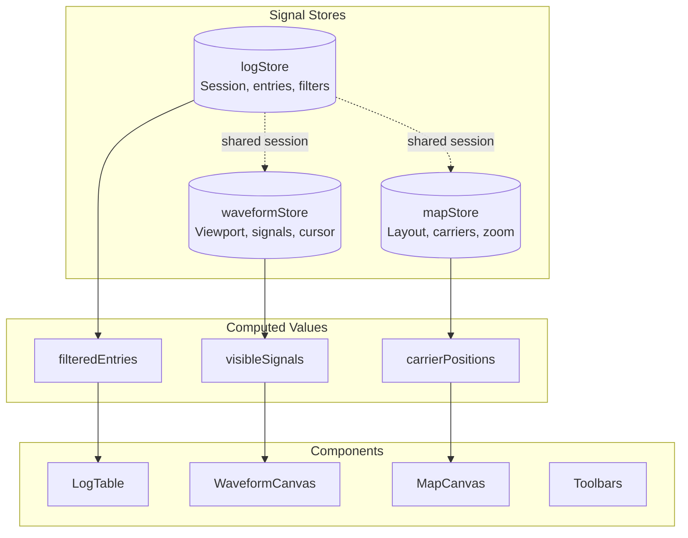
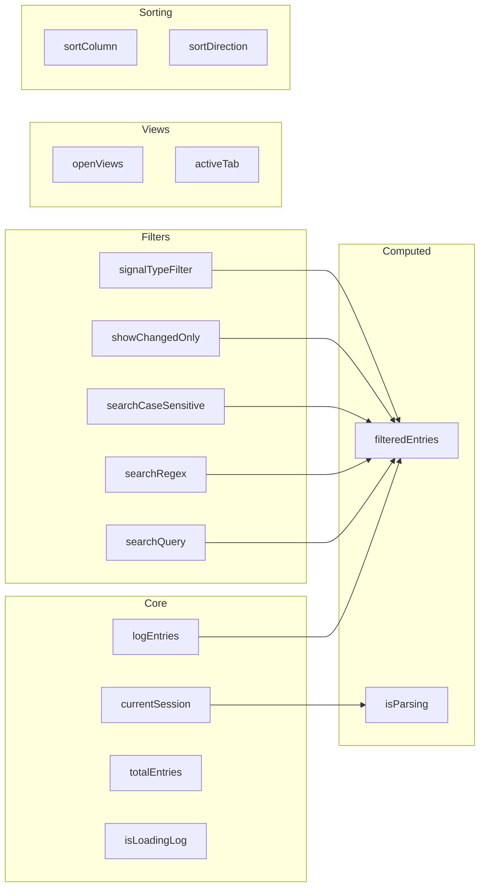
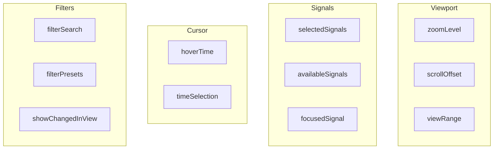
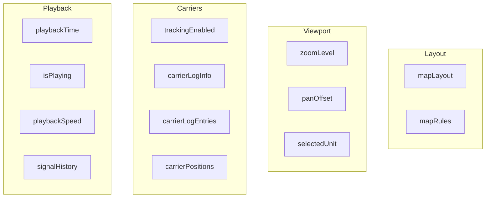
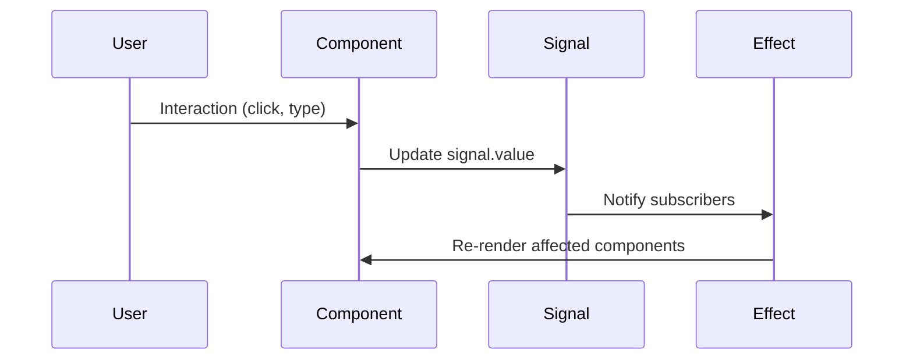

# State Management (Preact Signals)

How state is managed across the frontend using Preact Signals.

## Store Architecture



## logStore Signals



## waveformStore Signals



## mapStore Signals



## Signal Reactivity



## Key Patterns

### 1. Computed Values
```typescript
// Automatically updates when dependencies change
const filteredEntries = computed(() => {
    return entries.value.filter(e => 
        matchesSearch(e, searchQuery.value)
    );
});
```

### 2. Effects for Side Effects
```typescript
// Runs when viewport changes
effect(() => {
    const range = viewRange.value;
    fetchChunk(range.start, range.end);
});
```

### 3. Batched Updates
```typescript
// Multiple updates trigger single re-render
batch(() => {
    zoomLevel.value = newZoom;
    scrollOffset.value = newOffset;
});
```
