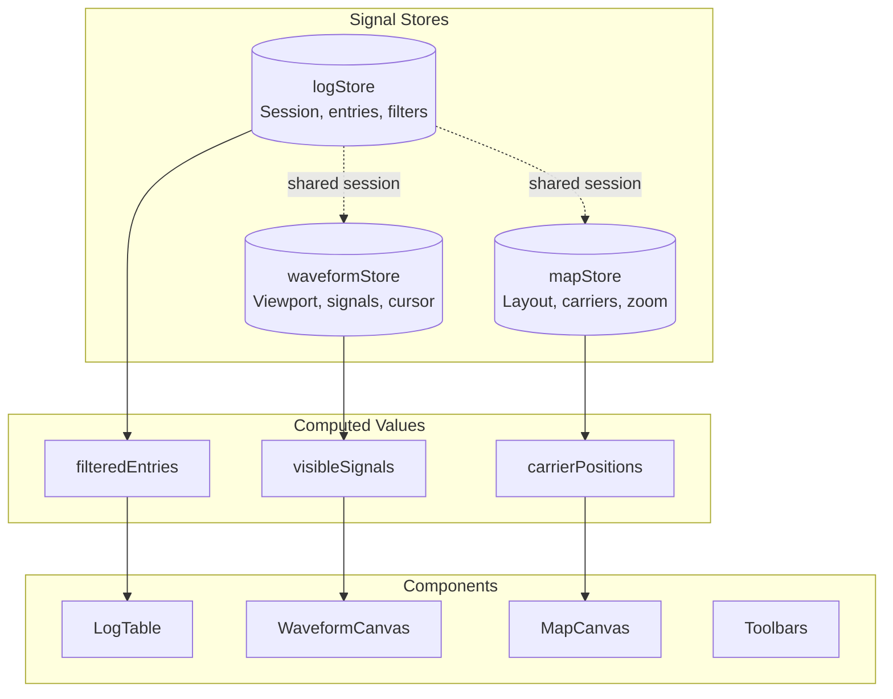
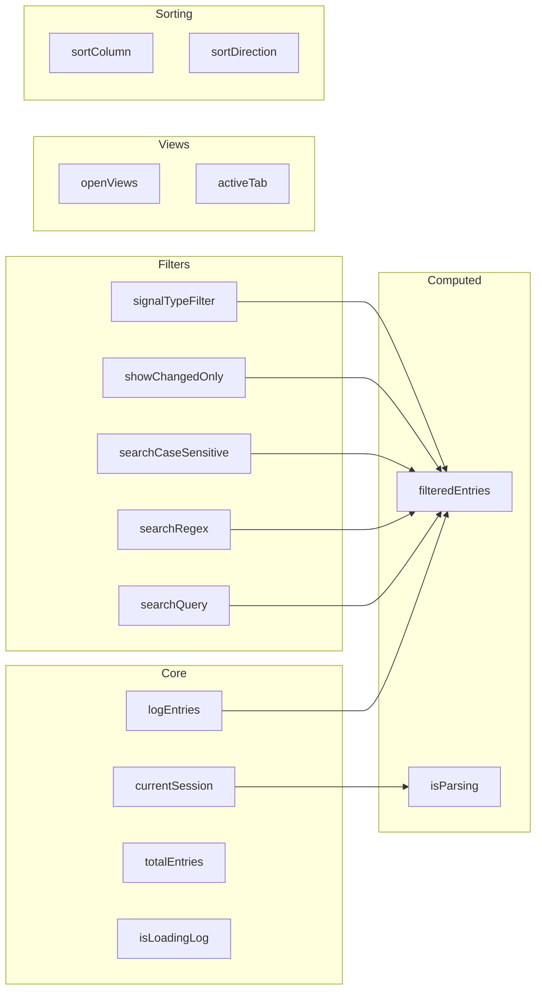
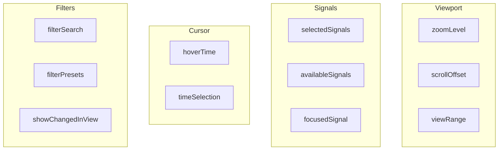
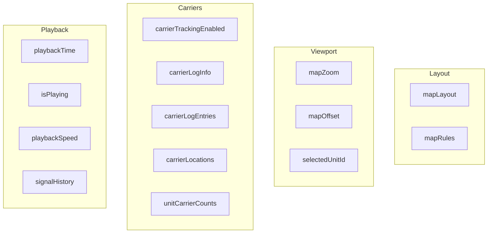
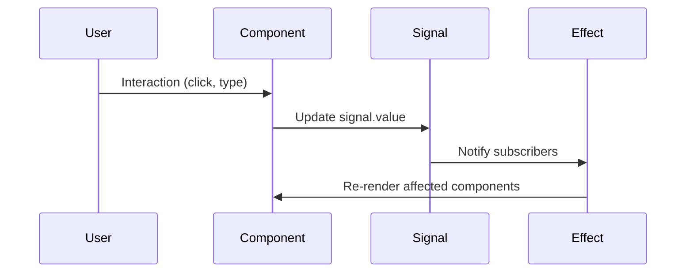

# State Management (Preact Signals)

How state is managed across the frontend using Preact Signals.

## Store Architecture



## Modular Store Structure

Each store is organized into modular files for better maintainability:

### Store Module Pattern

```
stores/
├── [storeName]/
│   ├── types.ts      # TypeScript interfaces
│   ├── state.ts      # Signals and computed values
│   ├── actions.ts    # Action functions
│   ├── utils.ts      # Pure helper functions (optional)
│   ├── effects.ts    # Side effects
│   └── index.ts      # Public exports
└── [storeName]Store.ts  # Backward-compatible re-export
```

### mapStore Architecture

```
stores/map/
├── types.ts      # MapObject, MapLayout, MapRules types
├── state.ts      # 45+ signals/computed (layout, rules, carrier, playback)
├── actions.ts    # 25+ async actions (fetch, load, toggle, sync)
├── utils.ts      # Pure helpers (color logic, device mapping, caching)
├── effects.ts    # Side effects (follow, sync, server fetching)
└── index.ts      # Public API exports
```

**Key Signals:**
- **Layout**: `mapLayout`, `mapLoading`, `mapError`
- **Rules**: `mapRules`, `canEnableRules`
- **Carrier**: `carrierLocations`, `carrierTrackingEnabled`, `unitCarrierCounts`
- **Playback**: `playbackTime`, `isPlaying`, `playbackSpeed`
- **Signal Log**: `signalLogSessionId`, `latestSignalValues`, `signalHistory`

### logStore Architecture

```
stores/log/
├── types.ts      # ViewType, ServerPageCache, FetchFilters
├── state.ts      # 30+ signals/computed (session, entries, filters, cache)
├── actions.ts    # 15+ actions (parsing, fetching, navigation)
├── effects.ts    # Persistence and filter change effects
└── index.ts      # Public API exports
```

**Key Signals:**
- **Session**: `currentSession`, `logEntries`, `totalEntries`
- **Loading**: `isLoadingLog`, `isStreaming`, `streamProgress`
- **Filters**: `searchQuery`, `categoryFilter`, `signalTypeFilter`, `showChangedOnly`
- **Sorting**: `sortColumn`, `sortDirection`
- **Views**: `openViews`, `activeTab`
- **Computed**: `filteredEntries`, `isParsing`, `useServerSide`

### waveformStore Architecture

```
stored/waveform/
├── types.ts      # FilterPreset, WaveformState
├── state.ts      # 25+ signals/computed (viewport, signals, presets)
├── actions.ts    # 18 actions (zoom, pan, selection, presets)
├── effects.ts    # Viewport init, signal list, data fetching
└── index.ts      # Public API exports
```

**Key Signals:**
- **Viewport**: `scrollOffset`, `zoomLevel`, `viewportWidth`, `viewRange`
- **Signals**: `allSignals`, `availableSignals`, `selectedSignals`
- **Selection**: `hoverTime`, `selectionRange`
- **Filters**: `signalSearchQuery`, `signalTypeFilter`, `filterPresets`
- **UI**: `isDragging`, `showSidebar`, `isWaveformLoading`

## logStore Signals



## waveformStore Signals



## mapStore Signals



## Signal Reactivity



## Key Patterns

### 1. Computed Values
```typescript
// Automatically updates when dependencies change
const filteredEntries = computed(() => {
    return entries.value.filter(e => 
        matchesSearch(e, searchQuery.value)
    );
});
```

### 2. Effects for Side Effects
```typescript
// Runs when viewport changes
effect(() => {
    const range = viewRange.value;
    fetchChunk(range.start, range.end);
});
```

### 3. Batched Updates
```typescript
// Multiple updates trigger single re-render
batch(() => {
    zoomLevel.value = newZoom;
    scrollOffset.value = newOffset;
});
```

### 4. Modular Store Exports
```typescript
// Import from modular structure
import { mapLayout, fetchMapLayout } from '../stores/map';

// Or use backward-compatible path
import { mapLayout, fetchMapLayout } from '../stores/mapStore';
```

## Testing Stores

Each store module has corresponding tests:

```
stores/
├── map/
│   └── __tests__/
│       └── utils.test.ts    # Pure function tests
├── log/
│   └── __tests__/
│       └── state.test.ts    # State/computed tests
└── waveform/
    └── __tests__/
        └── state.test.ts    # State/computed tests
```
