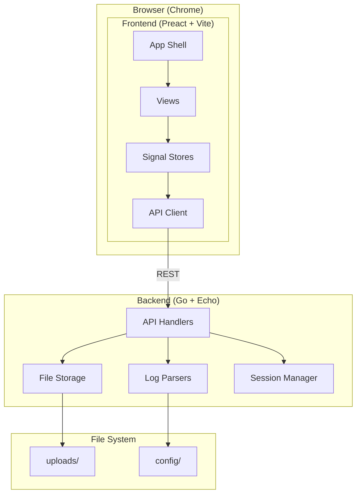
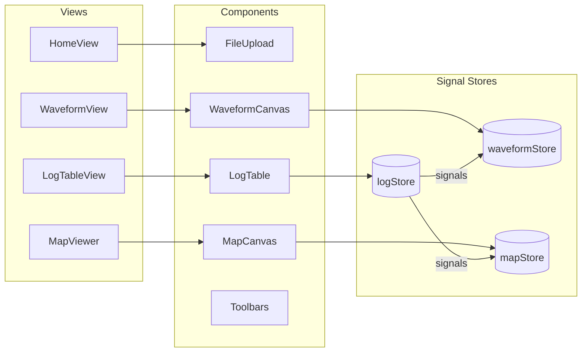
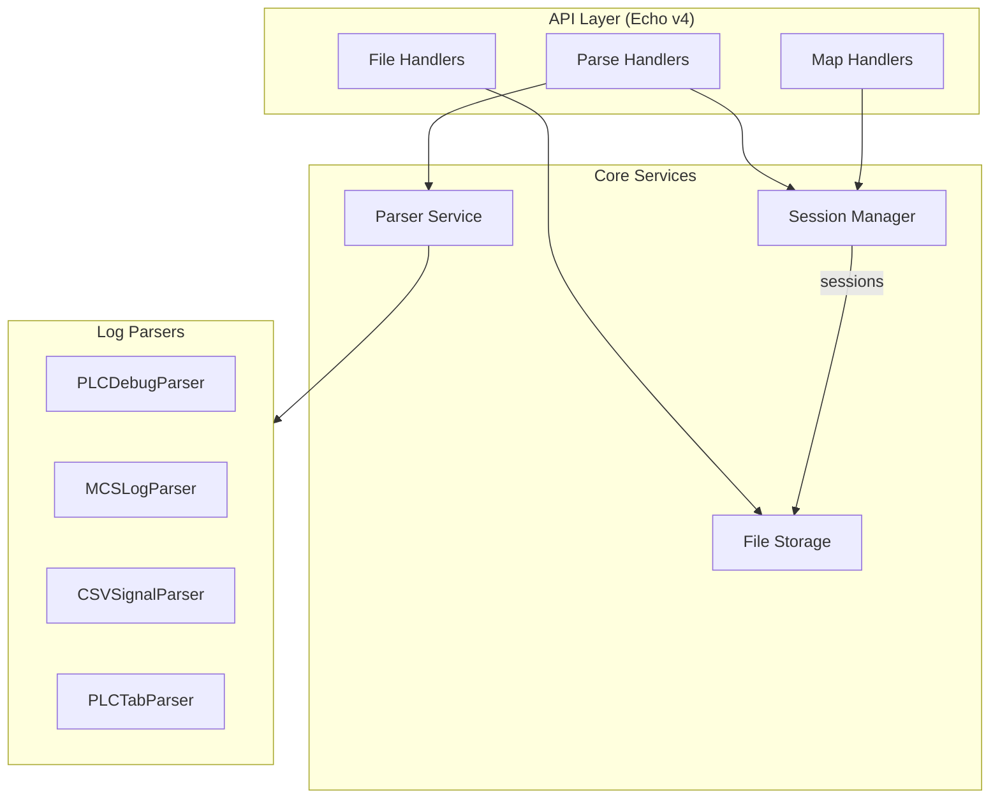

# System Overview

High-level architecture of the PLC Log Visualizer web application.

## Component Architecture

## Frontend Architecture

## Backend Architecture

## Technology Stack

| Layer | Technology | Purpose |
|-------|------------|---------|
| Frontend | Preact | UI framework (lightweight React) |
| State | @preact/signals | Reactive state management |
| Build | Vite | Fast dev server & bundler |
| Backend | Go 1.21+ | High-performance server |
| HTTP | Echo v4 | Web framework |
| Storage | Local filesystem | File uploads & sessions |
| Testing | Vitest + Playwright | Unit & E2E tests |
