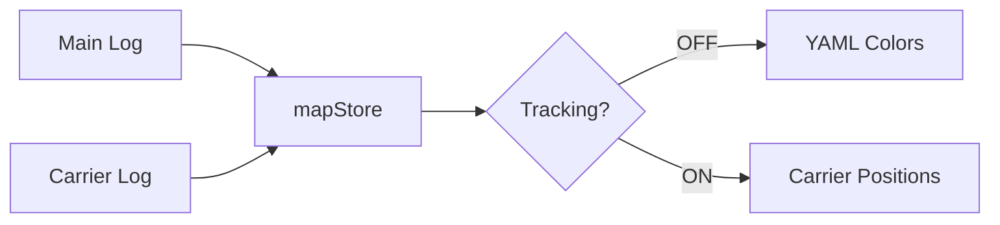

# CONTEXT.md — Session Context

> Paste this into each AI session. Last updated: 2026-01-16

---

## Quick Start

1. **Run tests first**: `cd frontend && npm run test:all`
2. **Check active tasks**: [TODO.md](.agent/TODO.md)
3. **Check blockers**: [SCRATCHPAD.md](.agent/SCRATCHPAD.md)
4. **Use workflow**: `/testing` before browser agent

---

## Session Instructions

When starting a session:

1. Run `cd frontend && npm run test:all` to verify codebase health
2. Check `.agent/TODO.md` for current tasks
3. Check `.agent/SCRATCHPAD.md` for blockers or context
4. Work on the next task
5. Update `.agent/CHANGELOG.md` with completed work
6. Update `.agent/TODO.md` to reflect progress

---

## Project

**PLC Log Visualizer (Web)** — Web port of PySide6 desktop application for industrial PLC log analysis.

| Layer | Technology |
|-------|------------|
| Backend | Go 1.21+ (Echo v4) |
| Frontend | TypeScript + Preact + Signals + Vite |
| Styling | CSS Variables (industrial dark theme) |
| Testing | Vitest + Playwright + ESLint |
| Browser | Chrome only |

---

## Repository Structure

```
/web_version
├── CONTEXT.md             ← You are here
├── TESTING_CHECKLIST.md   ← Test cases
├── .agent/
│   ├── workflows/         ← Agent workflows
│   ├── SCRATCHPAD.md      ← Current thinking, blockers
│   ├── CHANGELOG.md       ← What's been done
│   └── TODO.md            ← Task tracking
├── backend/
│   ├── cmd/server/        ← Entry point
│   ├── internal/
│   │   ├── models/        ← Domain types
│   │   ├── parser/        ← Log parsers
│   │   ├── storage/       ← File store
│   │   ├── api/           ← REST handlers
│   │   └── validation/    ← Validators
│   └── config/            ← YAML configs
└── frontend/
    ├── src/
    │   ├── components/    ← UI components
    │   ├── stores/        ← Signal stores
    │   ├── api/           ← API client
    │   └── models/        ← TypeScript types
    ├── e2e/               ← Playwright tests
    └── package.json
```

---

## Current Phase

**Phase 3 — Map Viewer + Carrier Tracking** 🚧

Active work: Carrier tracking logic linking MCS log signals to map units.

---

## Map Viewer Architecture

### Dual Log System

The Map Viewer supports **two separate log files**:

| Log | Purpose | Toggle State |
|-----|---------|--------------|
| Main PLC Log | Device signals + YAML color rules | Tracking OFF |
| Carrier Log (MCS) | CurrentLocation signals | Tracking ON |



### Configuration Files
- **XML Layout** — Unit positions, sizes, types
- **YAML Rules** — Device-to-unit mappings, color rules
- **Carrier Log** — MCS format with `CurrentLocation` signals

---

## API Endpoints

| Method | Endpoint | Description |
|--------|----------|-------------|
| POST | `/api/files/upload` | Upload log file |
| POST | `/api/files/upload/chunk` | Upload chunk (5MB) |
| POST | `/api/files/upload/complete` | Complete chunked upload |
| GET | `/api/files/recent` | List recent files |
| POST | `/api/parse` | Start parsing |
| GET | `/api/parse/:sessionId/status` | Parse progress |
| GET | `/api/parse/:sessionId/entries` | Paginated entries |
| GET | `/api/parse/:sessionId/chunk` | Time-window chunk |
| GET | `/api/parse/:sessionId/signals` | List signals |
| GET | `/api/map/layout` | Get map layout |
| POST | `/api/map/upload` | Upload map layout |
| GET/POST | `/api/map/rules` | Map rules (YAML) |
| POST | `/api/map/carrier-log` | Upload carrier log |
| GET | `/api/map/carrier-log/entries` | Carrier positions |

---

## Testing

| Command | Purpose | Speed |
|---------|---------|-------|
| `npm run typecheck` | Type checking | instant |
| `npm run lint` | ESLint | ~2s |
| `npm run test` | Unit tests | ~2s |
| `npm run test:e2e` | E2E tests | ~8s |
| `npm run test:all` | All of above | ~15s |

**Test hierarchy**: TypeCheck → Lint → Unit → E2E → Browser Agent (last resort)

---

## Key References

| When working on... | Reference... |
|--------------------|--------------|
| Desktop reference | `../plc_to_wavedrom/CONTEXT.md` |
| Test cases | `TESTING_CHECKLIST.md` |
| Task status | `.agent/TODO.md` |
| Recent changes | `.agent/CHANGELOG.md` |
